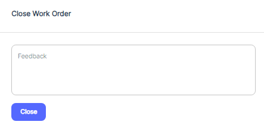
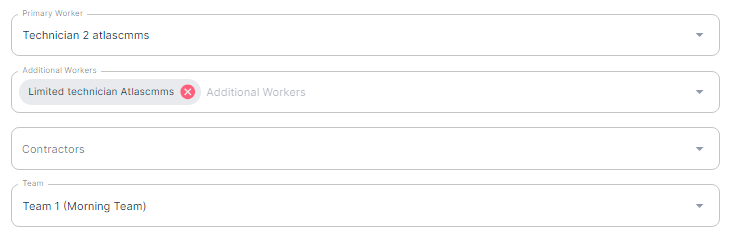

---

order: 30
---

Once the work order is set to complete, a prompt will be opened for the user to provide feedback or additional information about the task.

 This feedback can include details about the work performed, any issues encountered, 5Whys, Root Cause Analysis or recommendations for future maintenance.

If Timer kept running, upon submitting the feedback, the timer will automatically stop, and the work order status will be updated to "Complete," indicating that the asset is now back in service and ready for operation.

Important: Once Work Order Status is set to “Complete”, Work Order can no longer be Edited Except from an Admin Account.

By following these guidelines, users can effectively utilize work orders and timers to accurately track maintenance activities, monitor asset downtime, and ensure that maintenance records are up\-to\-date and comprehensive.

###### Reassign Work Order

To reassign a work order, access the work order record, click on the pencil icon shown in the image, 

and navigate to 'Primary Worker' to assign a new primary worker, or 'Additional Workers' or ‘Team’ to add or change team members. 

Enter the name of the new assignee, and press 'Save.' The new assignee will then receive a notification about the work order assignment.