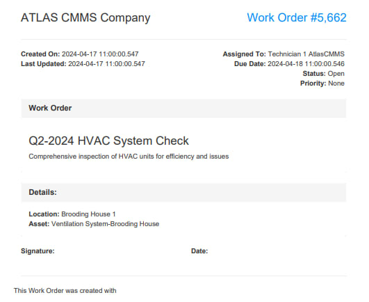
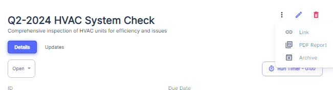
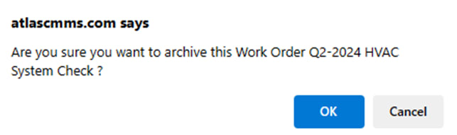

---

order: 60
---

###### Printing a Work Order

Printing work orders is an essential function within Atlas CMMS that allows users to generate physical copies or save digital versions of work orders for various purposes such as record\-keeping, task execution, and compliance. This chapter will guide you through the process of printing work orders and how to leverage this functionality effectively.

__How to Print a Work Order__

To print a work order in Atlas CMMS:

- Navigate to the Work Request module and select the work order you wish to print.
- Once you have selected the work order, look for the three vertical dots icon at the top right corner of the work order's view page 
- Click on this icon to reveal a dropdown menu with several options.
- From the dropdown menu, select "PDF Report" to generate a printable version of the work order.
- The system will create a PDF document of the work order, which includes all the relevant details such as the work order title, description, location, asset, and assigned technician, as well as the creation and due dates 

The ability to print work orders can be leveraged in several ways:

- Field Use: Technicians can carry printed work orders as a reference during maintenance tasks, especially in areas where digital device use is impractical or where there is no internet connectivity.
- Record\-Keeping: Keeping a physical or digital archive of work orders helps maintain a historical record of maintenance activities, which can be useful for audits, performance reviews, and planning future maintenance work.
- Compliance: Printed work orders can serve as proof of completed maintenance for regulatory compliance and warranty claims.
- Communication: Sharing printed work orders with team members or stakeholders can facilitate better communication and coordination, ensuring everyone is informed about the maintenance tasks and expectations.

__Work Order Lifecycle Printing__

Atlas CMMS allows users to print work orders at any stage of their lifecycle, from creation to completion. This ensures that users have access to the most up\-to\-date information at all times and can document the progression of maintenance activities.

- __At Creation__: Print the initial work order to begin the maintenance process.
- __During Updates__: Print updated work orders to reflect any changes or additional notes made during the execution of the task.
- __After Completion__: Print the final work order to include all details of the completed work, including any follow\-up actions or observations.

By utilizing the print function throughout the work order lifecycle, users can ensure that all relevant information is captured and accessible, both in digital and physical formats, enhancing the efficiency and traceability of maintenance operations within Atlas CMMS.

###### Archiving Work Orders

In Atlas CMMS, archiving work orders is a feature that allows organizations to manage their maintenance records by removing completed or outdated work orders from active tracking

__How to Archive a Work Order__

To archive a work order in Atlas CMMS:

- Navigate to the Work Orders module and locate the work order you wish to archive.
- Click on the work order to open its details.

- Look for the "Archive" button.
- Upon clicking "Archive," a confirmation window will appear \(as shown in the first image\), asking if you are sure you want to archive the selected work order. This step is crucial to prevent accidental archiving of active work orders.

- Review the work order ID and description in the confirmation window to ensure it is the correct one you intend to archive.
- If you are certain, click "OK" to proceed with archiving the work order.