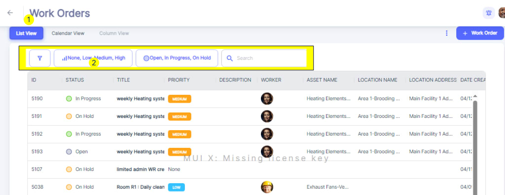
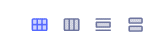
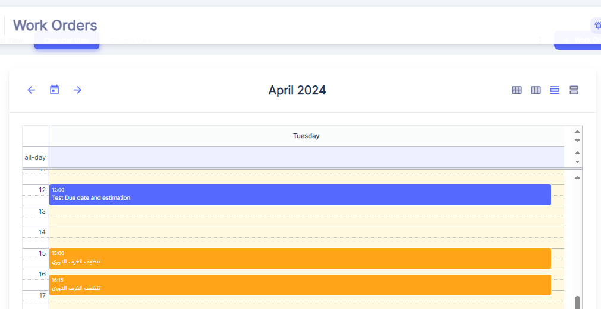
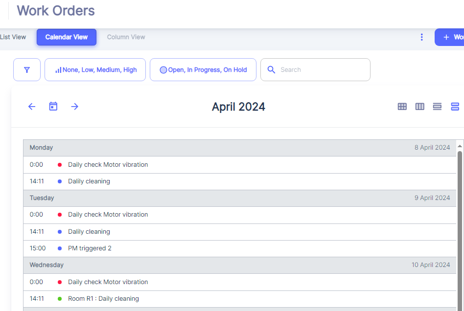
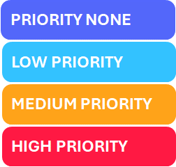
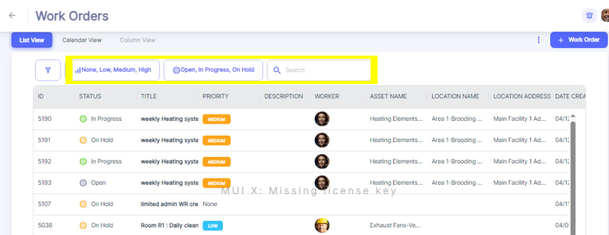
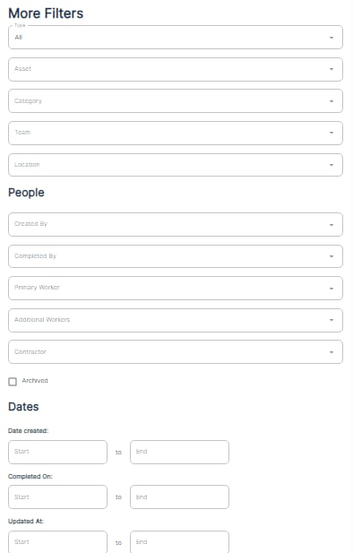

---

order: 100
---

###### List View:

Once in the Work Orders section, the user will be presented with a comprehensive table view that displays all the active work orders within the system.

This table provides a clear overview of each work order, with columns showing key details such as the work order ID, status \(Open, In Progress, On Hold\), title, priority level \(None, Low, Medium, High\), description, assigned worker, associated asset name, location name, location address, and the date the work order was created and last updated. Furthermore, the interface offers different viewing options, such as a Calendar View or Column view.

###### Calendar View

  

The Calendar View within the Work Orders module provides a visual representation of scheduled work orders. This view presents work orders in a familiar calendar format:

Users can navigate through the calendar by clicking on __Daily, Weekly Monthly and Agenda Views__

__Monthly: 	__

Today’s Box is marked in different Color \( Biege\).

You can go throughout past and next Months by using left and right arrows at top left and come back to Current Month any time by clicking the bottom between 🡨 and 🡪

__Weekly:__

Today’s Column is marked in different Color \( Biege\).

You can go throughout past and next weeks by using left and right arrows at top left and come back to Current week any time by clicking the bottom between 🡨 and 🡪

__Daily:__

__Agenda View:__

 \(Daily, Weekly, Monthly\) , making it easy to identify task distribution and potential scheduling conflicts at a glance .

__Color\-Coded Work Order Blocks__

Within the calendar grid, work orders are represented by colored blocks spanning the duration of the task. The use of different colors helps to distinguish between various Priorities of work orders quickly.

__Scheduling and Conflict Identification__

The Calendar View allows users to easily identify potential scheduling conflicts or overlaps. For instance, if multiple work orders are scheduled for the same day or time slot, the blocks will overlap, indicating a potential resource constraint or the need for prioritization.

This visual representation enables maintenance supervisors to proactively address scheduling issues, reallocate resources, or adjust work order timelines to ensure efficient and effective maintenance operations.

These alternative views enable the user to organize and visualize the work orders in a manner that best suits their preferences and workflow.

###### Filters deployment:

The user can easily filter the work orders based on their __status\(3\) __or __priority level__ using the respective drop\-down menus located above the table. 

4: a search function is available, allowing the user to quickly find specific work orders by entering relevant keywords.

###### More Filters

Additionally, User can open "More Filters" section by clicking on Filter icon on top left side:

The section offers a comprehensive set of filters to refine and customize the view or search results within the application.Here's an explanation of the different filters available:

1. __All__: This filter allows you to search across all fields or categories.
2. __Asset__: You can filter the results based on specific assets or equipment.
3. __Category__: This filter enables you to narrow down the results by different categories Work Orders.
4. __Team__: If your organization has multiple teams, you can filter the results to show only items associated with a particular team.
5. __Location__: This filter lets you view results based on specific locations or facilities.
6. __People__:
	- __Created By__: Filter the results based on who created the item or record.
	- __Completed By__: Filter the results by the person who completed or closed the item.
	- __Primary Worker__: Filter the results by the primary worker assigned to the item.
	- __Additional Workers__: Filter the results by any additional workers assigned to the item.
	- __Contractors__: Filter the results by contractors associated with the item.
7. __Dates__:
	- __Date Created__: Filter the results based on the date range when the items were created.
	- __Completed On__: Filter the results by the date range when the items were completed or closed.
	- __Updated At__: Filter the results based on the date range when the items were last updated.

These filters provide a powerful way to narrow down and focus on specific subsets of data within the application. For example, you could filter to view only work orders assigned to a particular team, created within a specific date range, and associated with a certain asset or location.

By combining multiple filters, you can create highly customized views tailored to your specific needs, making it easier to find and analyze relevant information quickly and efficiently.
