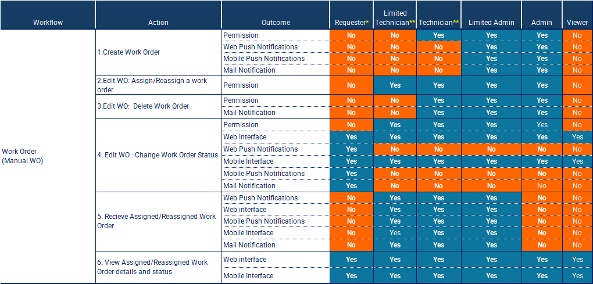
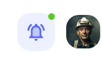
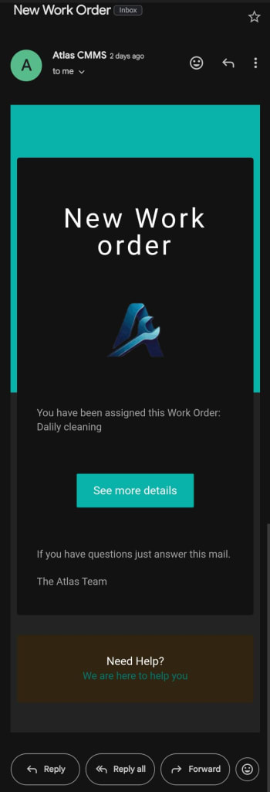
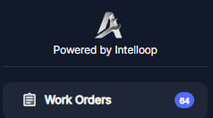

---

order: 80
---

##### Work Order Permissions and Notifications

Once a work order has been created, it is crucial to ensure that the right people are notified and have the appropriate permissions to act on the work order efficiently. This chapter will explain the various notifications and permissions associated with work orders, as well as the reasoning behind them.

Outcomes Legend:

- Permission: Permission to Do the Action.
- Web Push Notification: Get Push notification on Web interface after Action is done.
- Mobile Push Notification: Get Push notification on Web interface after Action is done.
- Mail Notification: Get E\-Mail notification after Action is done.
- Web interface: Get the immediate Web Interface View up\-date after Action is done.
- Mobile interface: Get the immediate Mobile Interface View up\-date after Action is done.

Refer to the table provided above, which outlines the actions, outcomes, and permissions for different user roles throughout the work order lifecycle.

###### Permissions

The table outlines the permissions granted to different user roles for various actions related to work orders. These permissions are designed to maintain control, accountability, and security within the system.

1. __Work Order Creation__: Roles such as Admin, Limited Admin or Technician have the permission to create work orders, ensuring that only authorized personnel can initiate maintenance requests.
2. __Work Order Status update__: Technicians and limited technicians have the permission to change the status of work orders and \( In Progress, On Hold, Complete\).
3. __Work Order Deletion__: Only Admins have the permission to delete work orders, preventing accidental or unauthorized deletions.
4. __Work Order Assignment/Reassignment:__ Reassign Work Order refers to changing the assignment of the work order from one user \(Primary Worker, Team or any member the work order was Assigned To\) to another. This process is a fundamental aspect of managing maintenance operations dynamically, ensuring that tasks are completed efficiently and effectively. 

See more details in [\(Tip 2: Reassigning Work Order:\)](../../../tips-annexes/tip-2-reassigning-work-order.md)

Cases of Notifications:

Once a work order is created, it is received by users depending on their assigned roles. Technicians and Limited Technicians are typically the recipients of work orders, as they are responsible for carrying out the maintenance tasks. They receive notifications and can view work order details through the web and mobile interfaces.

1. __Work Order Creation__: When a work order is created, notifications are sent to the relevant parties, such as the Admin, Limited Admin and the assigned User. This ensures that everyone is aware of the new work order and can take appropriate actions.
2. __Work Order Assignment/Reassignment__: When a work order is assigned or reassigned to a technician or team, notifications are sent to the assignee\(s\) and other relevant parties. This helps technicians stay informed about their workload and prioritize tasks accordingly.
3. __Work Order Updates__: As the work order progresses, notifications are sent to keep stakeholders updated on any changes in status, comments, or resource assignments. This transparency helps maintain accountability and facilitates effective communication.

Notifications are essential for maintaining a smooth workflow and ensuring that work orders are addressed promptly. They help minimize delays, miscommunications, and potential bottlenecks in the maintenance process.

Forms of Notifications:

In this chapter, we will explore the various forms of notifications that users can receive following the creation of a work order in Atlas CMMS. These notifications are designed to keep all relevant parties informed and up\-to\-date on the latest developments and assignments.

__Push Notifications on Web Application__

Upon the creation of a work order, relevant users will receive a push notification on their web application interface. An example of such a notification is shown above, where a small Green badge on the bell icon indicates that there are new notifications waiting to be reviewed. This visual cue prompts users to check their notifications for important updates.

__Bell Notifications__

When users click on the bell icon, as depicted above, they will see a list displaying their most recent notifications. This list includes details such as the type of notification \(e.g., work order assignments, status updates\), the subject of the notification \(e.g., "Daily check Motor vibration"\), and the time the notification was sent. Users can quickly scan through this list to get an overview of their pending tasks and any actions they need to take.

__Push Notifications on Mobile App__

Similar to web push notifications, mobile app notifications alert users to new work orders and updates. These notifications can appear even when the app is not actively in use, ensuring that users don't miss critical information. Tapping on the notification will typically take the user directly to the relevant work order or task within the app.

__Email Notifications__

The above shows an example of an email notification. Users will receive an email informing them of new work orders assigned to them, such as "Daily cleaning." The email includes a "See more details" button, which, when clicked, directs the user to the CMMS system where they can view the full work order details and take necessary action. 

In addition to the various forms of notifications discussed earlier, another way for users to stay informed about the status of work orders is by viewing the number of open work orders in real\-time directly from the main menu of the application. As shown in the attached image, the "Work Orders" section displays a badge with the number "64," indicating that there are 64 open work orders currently in the system.

By utilizing these various forms of notifications, the Atlas CMMS system ensures that users are kept informed about new work orders and updates in real\-time, allowing for prompt responses and efficient management of maintenance tasks. Whether through web or mobile push notifications, bell notifications, or email alerts, the system provides a robust communication framework to support the maintenance workflow.