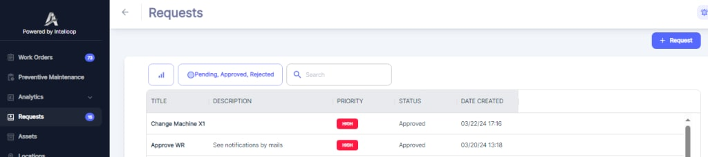

---

label: Accessing Work Requests
order: 9
---

To access the Work Requests menu, follow these steps:

1. From the main application interface, locate the left\-side navigation menu.
2. Click on the "Requests" menu item.

You will notice a number displayed next to the "Requests" menu item. This number indicates the current count of __open__ Work Requests in the system, providing you with a quick overview of the outstanding maintenance requests that require attention.
