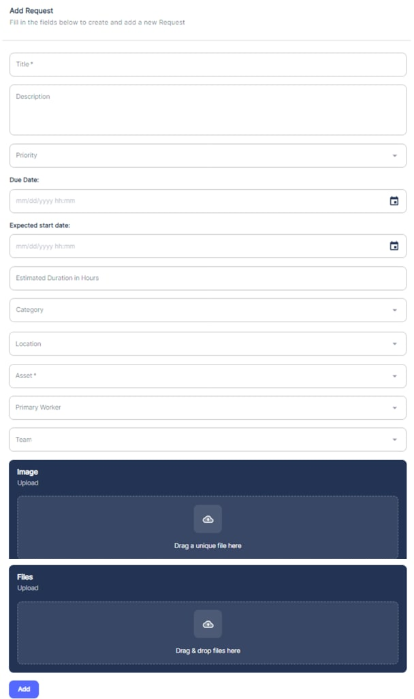

---

label: Creating A Work Request
order: 7
---
Creating a new Work Request in the Atlas CMMS is a straightforward process that allows you to capture all the necessary details and information related to a maintenance need or issue. To create a new Work Request, navigate to the Work Request module and click on the "\+ Work Request" button.This action will open the "Add Request" form, which consists of various fields that you need to fill out. 

Let's go through each field and understand its purpose:

1. __Title__\*: This is a mandatory field where you should enter a concise and descriptive title for the Work Request. The title should provide a clear overview of the maintenance issue or task at hand.
2. __Description__: In this field, you can provide a detailed description of the Work Request. This is where you can elaborate on the problem, symptoms, or specific maintenance requirements. Providing a comprehensive description will help the maintenance team better understand the scope of work and make informed decisions.
3. __Priority__: Using the dropdown menu, you can assign a priority level to the Work Request. The available options may include None, Low, Medium or High, depending on the urgency and impact of the maintenance need. Refer to “[Priority Assignment](../../tips-annexes/tip-1-priority-assignment.md)”
4. __Due Date__: This field allows you to specify the desired due date for the Work Request. The due date can help the maintenance team prioritize and schedule the work accordingly.
5. __Expected start date__: Here, you can indicate the expected start date for the maintenance work. This information can assist in resource planning and coordination.
6. __Estimated Duration in Hours__: In this field, you can provide an estimate of the time required to complete the maintenance task, expressed in hours. This information can aid in scheduling and resource allocation.
7. __Category__: Using the dropdown menu, you can assign the Work Request to a specific category. Categories are the same as Work Order Categories . Refer to “[Work Order Categories](../../initial-setup-and-configuration/configurations/categories-configuration.md/#work-order-categories)”
8. __Location__: This field allows you to specify the location where the maintenance work needs to be performed. This could be a building, floor, department, or any other relevant location identifier.
9. __Asset__\*: If the Work Request is related to a specific asset or equipment, you can select the asset from the dropdown menu in this field. In case of Location is set, only Assets related to above Locations will be displayed.
10. __Primary Worker__: If you know the technician or maintenance personnel who should be assigned to this Work Request, you can select them from the dropdown menu in this field.
11. __Team__: Alternatively, if a specific team or department is responsible for handling this type of maintenance work, you can select the appropriate team from the dropdown menu.
12. __Image/File Upload__: This sections allow you to upload relevant images or documents that can provide visual context or additional information related to the Work Request. For Photos, You can drag and drop images or use your mobile Camera to attach photo. To attach files, drag and drop or click the respective upload buttons.

Once you have filled out all the necessary fields, click the "Add" button to submit the new Work Request. The Work Request will then be added to the system and can be reviewed, prioritized, and assigned for further action by the maintenance team.

By providing comprehensive and accurate information in the "Add Request" form, you can ensure that the maintenance team has all the necessary details to efficiently address the maintenance need, allocate resources appropriately, and maintain a well\-documented maintenance history.

##### Responding to Pending Work Request

When a new work request is created in Atlas CMMS, it is automatically assigned a "Pending" status. This indicates that the request is awaiting review and action from an authorized user. Admins and limited admins have the ability to respond to these pending work requests in one of two ways:

##### Approving and Assigning a Work Order

If an admin or limited admin determines that a pending work request requires maintenance action, they can approve the request and assign it as a new work order. Here are the steps:

1. From the Work Requests list, locate the pending request you want to act on and open its details.
2. Review the request details, including the title, description, priority, due date, location, asset, and any attached images or documents.
3. Click the "Approve" button. This will open a new window to create a work order.
4. The new work order form will be pre\-populated with the relevant details from the original work request, such as the title, description, asset, and location.
5. Edit or add any additional information to the work order as needed, such as assigning a technician, setting the expected start date, adding tasks or procedures, and adjusting the priority level.
6. Refer to the "Creating Manual Work Orders" chapter for detailed guidance on filling out the work order form.
7. Once you have reviewed and completed the work order details, submit the new work order.
8. The status of the original work request will now be updated to "Approved."

By approving and assigning a work order from a pending request, you ensure that the maintenance need is properly documented, prioritized, and assigned to the appropriate personnel for resolution.

##### Rejecting a Work Request

In some cases, an admin or limited admin may determine that a pending work request does not require maintenance action or is not valid. In such situations, they can reject the request. Here's how:

1. From the Work Requests list, locate the pending request you want to reject and open its details.
2. Review the request details to ensure that rejection is the appropriate action.
3. Click the "Reject" button. This will open a new window with a "Feedback" text area.
4. In the "Feedback" area, provide a brief explanation or reason for rejecting the work request. This feedback will be visible to the original requester.
5. Click "Reject" to confirm the rejection.
6. The status of the original work request will now be updated to "Rejected."
7. The requester who submitted the work request will receive a notification informing them of the rejection and the provided feedback.

By rejecting a work request, you ensure that unnecessary or invalid requests are properly addressed, and the requester receives feedback on the decision.Whether approving and assigning a work order or rejecting a work request, the actions taken by admins and limited admins are crucial in maintaining an efficient and organized maintenance workflow within Atlas CMMS. These actions ensure that valid maintenance needs are promptly addressed, while also providing transparency and communication to requesters regarding the status of their submissions.
