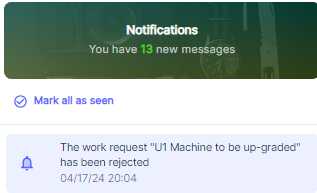
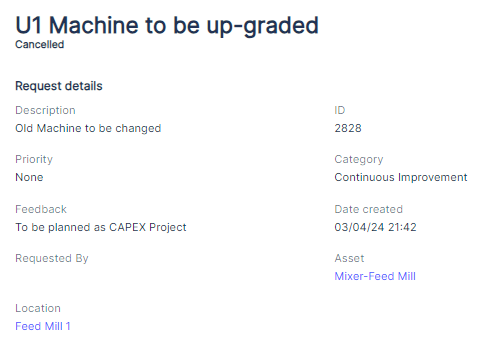

---

label: Viewing Specific Request Status And Feedback
order: 4
---
To view the status of an approved request or the feedback for a rejected request, the Requester can navigate to the Work Requests list, locate the specific request, and open its details.

After a work request has been responded to by an Admin or Limited Admin, the Requester's role changes from editing to viewing the status and any relevant feedback:

1. __Approved Requests__:

If the work request is approved and a work order is assigned, the Requester can view the advanced status of the related work order. This allows them to track the progress of the maintenance task and stay informed about its completion.

1. __Rejected Requests__: If the work request is rejected by an Admin or Limited Admin, the Requester will get a notification and be able to see the feedback provided for the rejection. This feedback offers insights into why the request was not approved and helps the Requester understand the decision\-making process.

 

By allowing Requesters to edit pending work requests, the Atlas CMMS ensures that maintenance needs can be accurately communicated and refined before they are reviewed by Admins or Limited Admins. This collaborative approach enhances the efficiency and effectiveness of the maintenance management process.Once a work request has been responded to, the Requester's role transitions to monitoring the progress of approved requests and understanding the reasons behind rejected requests. This transparency keeps Requesters informed and engaged throughout the maintenance lifecycle.
