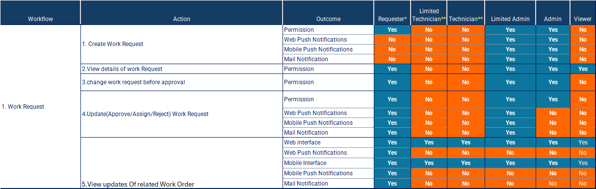

---

label: Work Requests Permissions And Notifications
order: 6
---
Effective management of work requests within the Atlas CMMS requires a well\-defined system of permissions and notifications to ensure proper control, accountability, and communication among various user roles. This chapter will explain the various permissions and notifications associated with work request workflows.

##### Permissions

The matrix outlines the permissions granted to different user roles for various actions related to work requests.

1. __Create Work Request__: The Requester role has the permission to create new work requests, allowing various stakeholders to initiate maintenance needs or issues.
2. __View details of Work Request__: Requesters, Limited Admins, Admins, and Viewers have the permission to view the details of a work request, enabling them to track the status and progress of their submitted requests.
3. __Change Work Request before approval__: Requesters, Limited Admins, and Admins have the permission to modify or update work requests before they are approved or assigned, allowing for corrections or additional information to be added.
4. __Update/Approve/Assign/Reject Work Request__: Limited Admins and Admins have the permission to take actions on work requests, such as approving, assigning, or rejecting them. This ensures that only authorized personnel can manage and prioritize maintenance tasks.
5. __View updates of related Work Order__: Once a work request is converted into a work order, Technicians, Limited Technicians, Limited Admins, and Admins have the permission to view updates and status changes related to the corresponding work order, enabling them to track the progress of maintenance activities.

##### Notifications

Similar to other maintenance workflows, notifications play a crucial role in keeping stakeholders informed about the status and progress of work requests. The matrix indicates that notifications are sent through various channels, such as web push notifications, mobile push notifications, and email notifications.

1. __Work Request Creation__: When a new work request is created, notifications are sent to the relevant parties, such as Limited Admins and Admins, alerting them of the incoming maintenance request.
2. __Work Request Updates__: When a work request is updated, approved, assigned, or rejected, notifications are sent to the appropriate roles, such as the Requester, Technicians, Limited Technicians, Limited Admins, and Admins. This ensures that all stakeholders are aware of the current status and can take necessary actions.
3. __Work Order Updates__: If a work request is converted into a work order, notifications are sent to the assigned Technicians, Limited Technicians, Limited Admins, and Admins, keeping them informed about any updates or status changes related to the corresponding work order.
